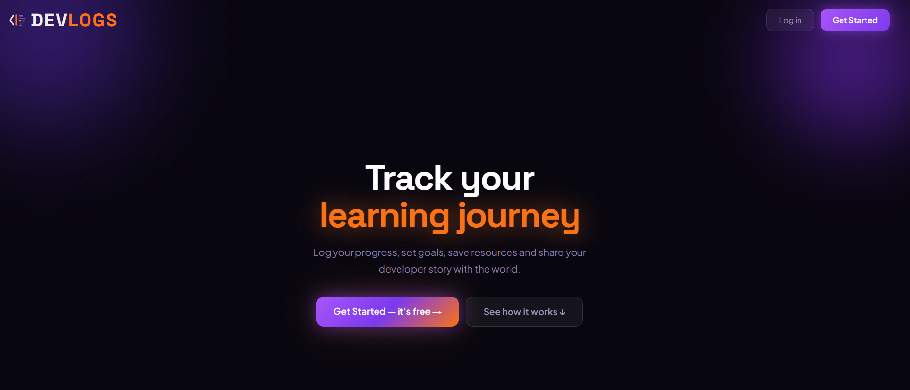
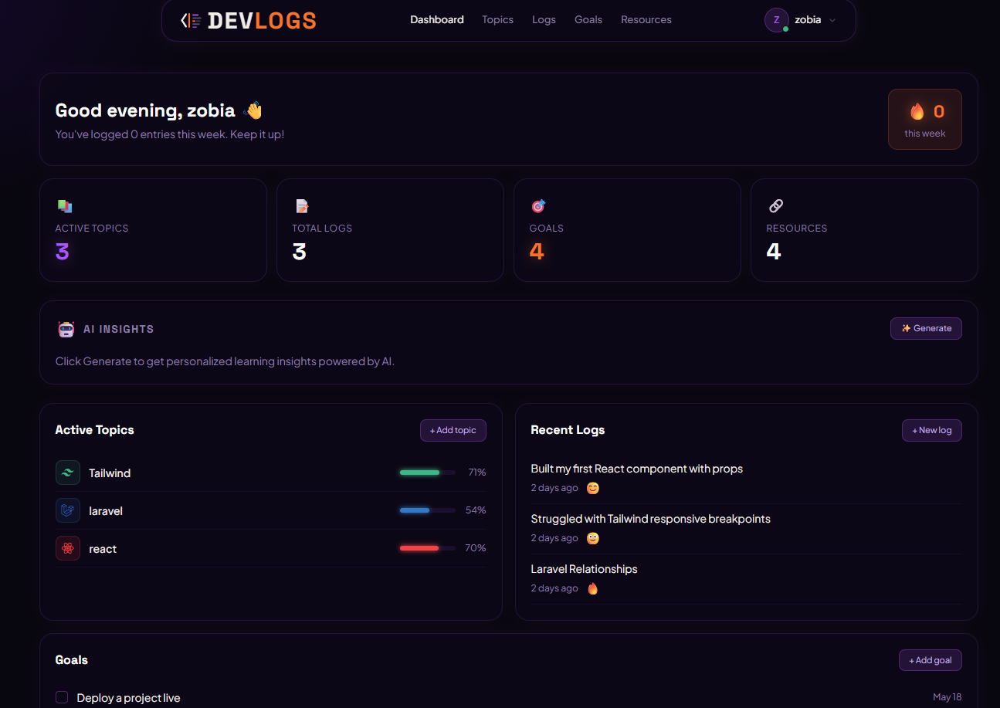
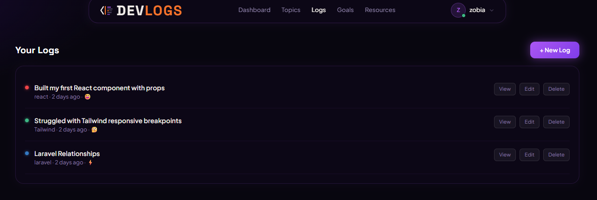
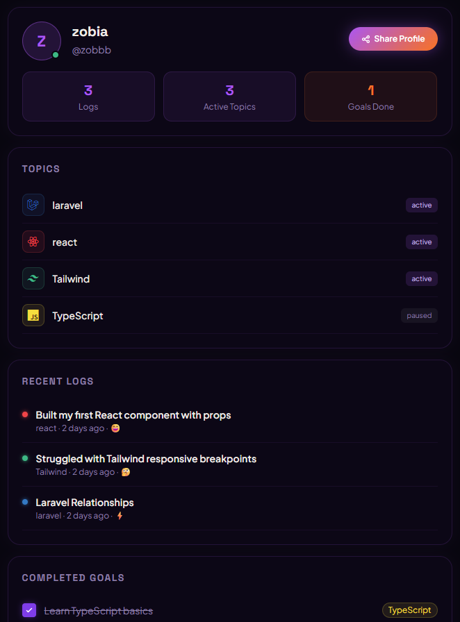
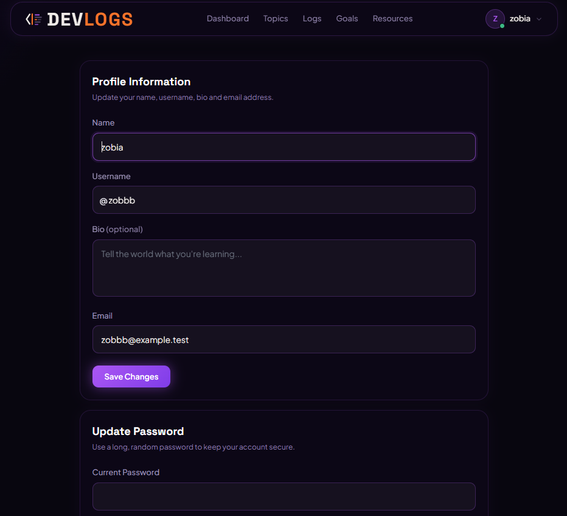
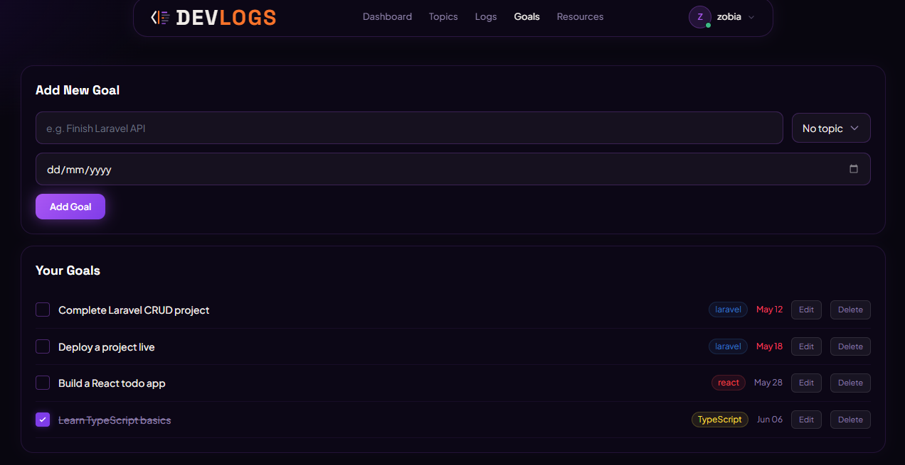
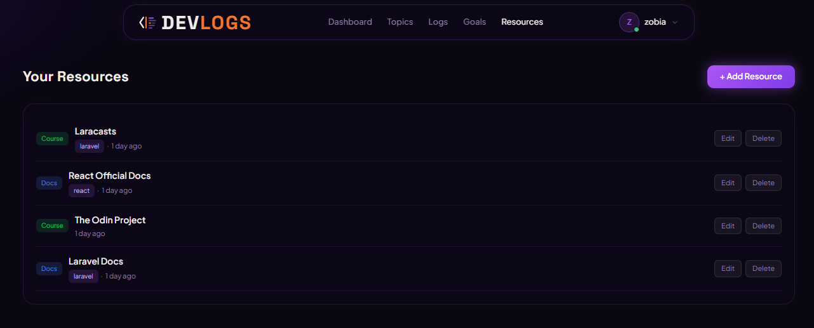
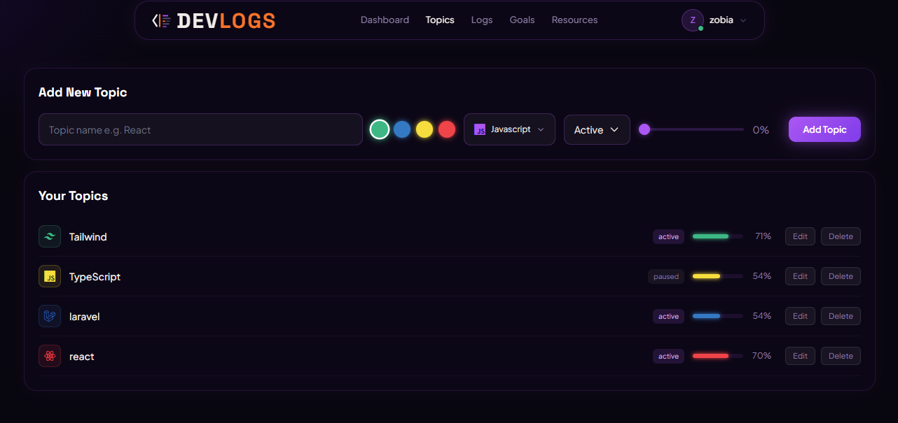
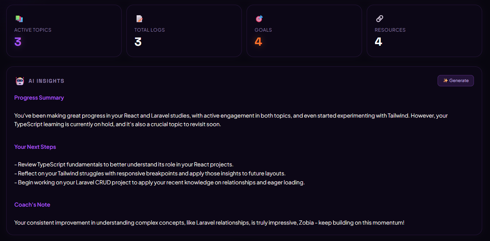
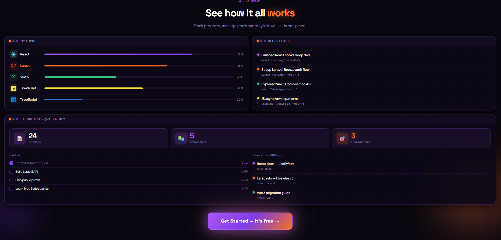

# DevLogs

DevLogs is a developer-focused social platform where users can share posts, track learning progress, set goals, explore resources, and interact with other developers in a modern community-driven environment.

---

## 🚀 Features

- Authentication system
- Create and manage developer logs
- Public user profiles
- Goal tracking
- Developer resources section
- Topics/categories system
- AI insights integration
- Responsive modern UI
- Dark themed experience
- Personalized dashboard

---

## 🛠️ Tech Stack

- Laravel
- PHP
- MySQL
- Blade
- Tailwind CSS
- Alpine.js

---

## 🌐 Live Demo

https://devlogs.42web.io

---

## 📸 Screenshots

### Welcome Page



---

### Dashboard



---

### Developer Logs



---

### Public Profile



---

### User Profile



---

### Goals System



---

### Resources Section



---

### Topics Section



---

### AI Insights



---

### Demo Page



---

## ⚙️ Installation

```bash
git clone https://github.com/zobdhillon/devlogs.git

cd devlogs

composer install

cp .env.example .env

php artisan key:generate

php artisan migrate

php artisan serve
```

---

## 📌 Project Status

DevLogs is currently under active development with new features and UI improvements being added continuously.